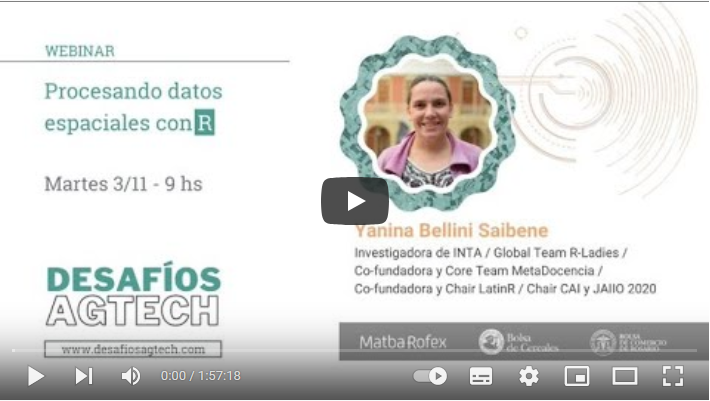

## Procesando datos espaciales con R

### Video

En el siguiente video se presenta el seminario, la primera mitad del taller presenta conceptos de teledetección, indices multiespectrales, firma espectral y como esto se relaciona con los cultivos.

La segunda parte del video presenta la práctica con código que puden encontrar en los dos siguientes capítulos.

### Slides

Pueden acceder a las slides desde este link: https://docs.google.com/presentation/d/1Mu50nWCI4Y-k0hQCbQAHKO1qWlboDafifWGnNues8w0/edit?usp=sharing

