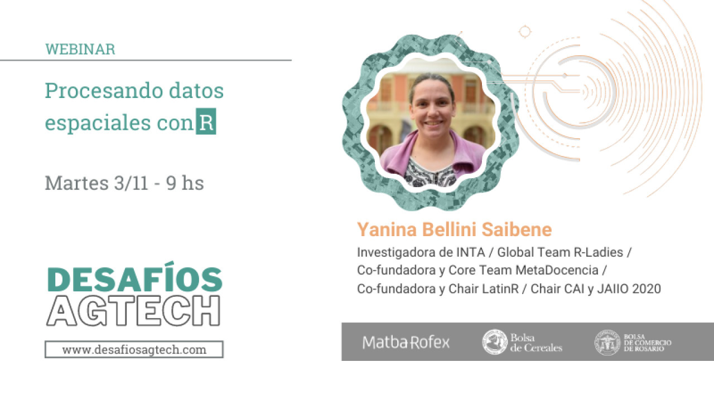

## ¿De qué se trata este curso?

Este curso está pensado para [personas](personas.html) que ya usan Google Earth Engine (GEE) y quieren empezar a usarlo desde R o bien que quieren iniciarse en el uso de GEE y el paquete rgee.

Veremos conceptos básicos de datos espaciales, los paquetes disponibles en R para trabajar con este tipo de datos y nos enfocaremos en el paquete rgee para el uso de Google Earth Engine desde R. 

Los materiales presentan un video con el taller completo, incluyendo conceptos teóricos y práctica con código. 

El taller fue dictado como un seminario web para [Desafíos AgTech 2020](https://desafiosagtech.com/)



## Antes de empezar

### Google Earth Engine
Necesitamos que te registres en la herramienta para poder utilizarla durante el curso, para ello debes entrar en este link:

https://signup.earthengine.google.com/

### R y RStudio

Asumimos que tenes instalado R y RStudio, si no es así [seguí estas intrucciones](https://paocorrales.github.io/deExcelaR/instalacion.html) que Paola Corrales y Elio Campitelli escribieron de forma tan clara.

### Paquetes de R para trabajar con datos espaciales

Vas a tener que instalar una serie de paquetes que te permiten trabajar con datos espaciales, algunos los usaremos durante el seminario web.

#### Paquetes para trabajo con datos
`install.packages("tidyverse")`

#### Paquetes para trabajo con datos espaciales: r-spatial

```{r eval=FALSE}
install.packages("sf") # para trabajar con datos vectoriales y rgee depende de sf
install.packages("raster") # para trabajar con datos raster.
install.packages("mapedit") #para trabajar con mapas interactivos.
install.packages("tmap") # para generar mapas temáticos.
```

#### Paquetes para trabajo con GEE

Para instalar **rgee** desde GitHub ejecutar este código de R:

`remotes::install_github("r-spatial/rgee")`

Si el código anterior te da error puede ser que necesites instalar la librería **remotes**

`install.packages('remotes')`

y luego puedas ejecutar `remotes::install_github('r-spatial/rgee')` sin problemas.

Es necesario instalar miniconda para que **rgee** funcione. La función `ee_intall()` se encarga de esta tarea.  Se ejecuta solamente una vez.

```{r eval=FALSE}
library(rgee)  # cargamos el paquete rgee
ee_install() # pedimos que instale miniconda

# Inicializar Earth Engine! (vamos a necesitar tener nuestro usuario habilitado)
ee_Initialize()
```

Adicionalmente, si tuviste algún problema durante la instalación estas funciones pueden ser útiles para comprobar el estado de las dependencias de rgee y eliminar las credenciales. 

```{r eval=FALSE}
ee_check() # Verifica las dependencias que no son de R
ee_clean_credentials() # Eliminar credenciales de un usuario específico
ee_clean_pyenv() # Eliminar variables del sistema
```


## ¿Quién soy? 

**Yanina Bellini Saibene**


Yanina Bellini Saibene, MSc. Lic. Es investigadora titular en el Instituto Nacional de Tecnología Agropecuaria (INTA, Argentina). Aplica sus conocimientos de informática y ciencia de datos para llevar los desarrollos tecnológicos a las regiones rurales de Argentina. Coordina la Red Nacional de Modelización de Agroecosistemas en el INTA. También desarrolla software para apoyar la investigación y la educación. Es profesora de grado y posgrado en varias universidades de Argentina y Uruguay, enseñando Ciencia de Datos aplicada y desarrollando cursos abiertos y tutoriales para enseñar habilidades técnicas en el manejo de datos. Es trainer e instructora de [The Carpentries](https://carpentries.org/) e instructora certificada de [RStudio](https://education.rstudio.com/trainers/people/bellini_saibene+yanina/). Tambiés es miembro del Executive Council de The Carpentries y Conferences Team Lead de [Forwards](https://forwards.github.io/). Es cofundadora y miembro del Core-Team de [MetaDocencia](http://metadocencia.org/). Forma parte del equipo de [R-Ladies Global](https://rladies.org/), preside varias conferencias internacionales (useR! 2021, LatinR, JAIIO) y es conferencista internacional. También lidera y participa en la traducción comunitaria de material educativo y técnico al español, como [Teaching Tech Together](https://teachtogether.tech/es/index.html), [R4DS](https://es.r4ds.hadley.nz/) y lecciones de The Carpentries. 

[yabellini.netlify.com](https://yabellini.netlify.com/)
[\@yabellini](https://twitter.com/yabellini)


___

## Licencia

<a rel="license" href="https://creativecommons.org/licenses/by-sa/4.0/deed.es_ES"></a><br />
Todo el material de este curso está bajo la licencia <a rel="license" href="https://creativecommons.org/licenses/by-sa/4.0/deed.es_ES">Creative Commons Attribution-ShareAlike 4.0 International License</a>.

Nos inspiramos y basamos en los siguientes recursos:

* 250 ejemplos de uso de **rgee**: https://csaybar.github.io/rgee-examples/
* Teledetección y bandas mutiespectrales: https://mappinggis.com/2019/05/combinaciones-de-bandas-en-imagenes-de-satelite-landsat-y-sentinel/
* Manual de agricultura de precisión utilizando imágenes satelitales: http://www.rederural.gov.pt/centro-de-recursos/send/10-inovacao/1860-agricultura-de-precisao-com-imagens-de-satelite-manual-de-boas-praticas-agricolas
* Handbook de rgee: https://github.com/barja8/Handbook_rgee

El código fuente de estos materiales y la página web pueden encontrarse en https://github.com/yabellini/curso_rgee.

Puedes citar ester recurso como:

> Yanina Bellini Saibene. (2022). yabellini/curso_rgee: Procesando datos espaciales con R (v1.0). Zenodo. https://doi.org/10.5281/zenodo.5849116
